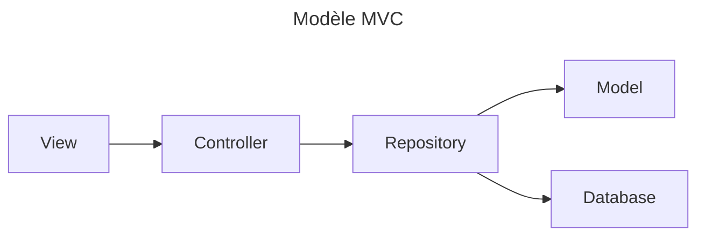

# projetWebS3
Bonjour, bienvenue dans notre github concernant notre projet de forum. Dans ce document vous pourrez voir l'organisations et le fonctionnement de notre site.

---------------------------------------------------------------------------

### Table des matières
1. [Introduction](#introduction)
2. [Schéma de class](#schéma-de-class)

---------------------------------------------------------------------------

## Introduction
Ce projet est un projet étudiant qui a pour but la création d'un site sous la forme d'un forum sur un thème libre. L'objectif est ici de travailler sur le language de programmation **PHP** qui fais partie des nouveau language appris. Ce site est donc un rendu de ce travail de 2ème année au BUT Informatique d'Aix-en-Provence. Ce projet prend place dans le cadre du cours de Programmation Web côté serveur.

---------------------------------------------------------------------------

## Schéma de class
Dans les demandes et obligation du projet il est marqué que l'on est obligé d'utilisé le modèle MVC le diagramme de class est donc comme ceci :

En plus de cela nous avons décidé que l'index de notre site ne possède pas d'**HTML** mais serve plutôt en tant que redirecteur et collecteur d'information pour permettre la naviguation dans le forum.

TODO : faire le vrai schéma de class (très long au vu du nombre de page et de class)
